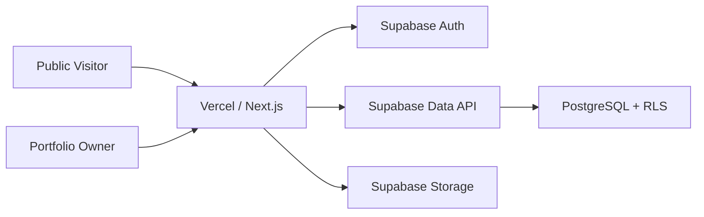

# milanesram.com — Professional Portfolio

**Live site:** [https://milanesram.com](https://milanesram.com)

**Production `v1.0.2`** is the current public release.

This repository contains the production portfolio and hosted content-management platform behind [milanesram.com](https://milanesram.com). It is published for professional review as a technical artifact relevant to cybersecurity, GRC, privacy, AI governance, information security, IT risk, and technology roles.

---

## Production Status

| Item | Value |
|---|---|
| Production domain | [https://milanesram.com](https://milanesram.com) |
| Canonical hostname | `milanesram.com` |
| Release tag | [`v1.0.2`](https://github.com/milanesram/milanesram-portfolio/releases/tag/v1.0.2) |
| Production release commit | `8f467892e7851d79cba1a983f08506df4aa767f0` |
| Hosting | Vercel |
| Database / content platform | Supabase |
| Framework | Next.js + TypeScript |

`v1.0.2` is the current production-validated release. Later commits on `main` may contain documentation or subsequent development work and should not be assumed to be the frozen production snapshot. The previous Production release remains `v1.0.1`. The initial Production release remains `v1.0.0`.

---

## Portfolio Areas

The public site presents:

- professional overview and biography
- cybersecurity, GRC, and IT risk
- privacy and AI governance
- professional experience
- projects
- professional writing and publications
- education
- credentials
- resume presentation

An authenticated owner administration interface manages hosted portfolio content. Public visitors do not have access to that interface.

---

## Technology Stack

- Next.js 16
- TypeScript
- React
- Tailwind CSS
- Supabase
  - PostgreSQL
  - Authentication
  - Row-Level Security
  - Storage
- Vercel
- Cloudflare DNS

---

## Architecture

Public pages render published portfolio content through a Next.js application hosted on Vercel. The application reads and writes hosted records through Supabase. Public reads are constrained by PostgreSQL Row-Level Security. Owner administration uses authenticated server sessions. Privileged database procedures and server-only environment variables stay off the public client path.



This diagram describes the public architecture only. It does not include credentials, project IDs, internal URLs, or private infrastructure data.

---

## Security Design

Security was treated as an architectural requirement, not a post-launch overlay.

- PostgreSQL Row-Level Security is enabled on application tables.
- Public data access is limited to published records.
- Parent/child publication state is enforced so child records are not publicly readable unless the parent is also published.
- Administration is restricted to an authenticated owner session.
- Browser-safe and privileged Supabase clients are separated. The privileged client is server-only.
- Privileged environment variables remain server-only and must never use a `NEXT_PUBLIC_` prefix.
- No service-role credential is included in browser or client bundles.
- Privileged database procedures have restricted execute grants.
- `.env` files are excluded from Git.
- Contact and public inquiry functionality remains disabled unless deliberately enabled through both hosted settings and server-only configuration.
- SQL migrations are retained as source-controlled security and infrastructure history.

The repository may document environment-variable names. It does not store production secret values.

See [docs/SECURITY.md](docs/SECURITY.md).

---

## Content Architecture

Version 1.0 moved substantial portfolio content into hosted Supabase-backed records. Representative managed areas include:

- site profile
- site settings
- projects
- project sections
- professional experience
- education
- certifications
- credentials
- focus pages
- publications
- media assets

Content can be revised through the owner CMS without a major application redesign, while publication behavior remains controlled by status fields and RLS.

---

## Supabase and Database Design

Schema and policy history lives in [`supabase/migrations/`](supabase/migrations/).

Migration history documents the evolution of:

- content tables
- owner authorization
- Row-Level Security
- public read policies
- administrative access
- project and experience relationships
- publications
- media
- public inquiry safeguards
- release-oriented content changes

See [docs/SUPABASE_ARCHITECTURE.md](docs/SUPABASE_ARCHITECTURE.md).

---

## Administrative CMS

The owner CMS is available only after authenticated sign-in. There is no public registration path.

Representative management capabilities include:

- projects
- experience
- education
- certifications
- credentials
- publications
- site settings
- other hosted portfolio content such as home/about chrome, resume presentation, media metadata, and SEO

See [docs/ADMIN_GUIDE.md](docs/ADMIN_GUIDE.md).

---

## Deployment

Production is hosted on Vercel at the custom domain `milanesram.com`.

Deployment practice includes:

- environment-variable separation between browser-safe and server-only values
- a controlled Supabase migration process
- a canonical production domain
- generated sitemap and robots configuration
- production route validation
- release tagging and source-control reconciliation against the frozen production release commit

See [docs/PRODUCTION_DEPLOYMENT_RUNBOOK.md](docs/PRODUCTION_DEPLOYMENT_RUNBOOK.md).

---

## Repository Structure

```text
.
├── src/app                 # App Router: public pages, admin, sitemap, robots
├── src/components          # Public and owner-admin UI
├── src/lib                 # Content adapters, admin logic, Supabase clients
├── supabase/migrations     # Schema, RLS, and content-history SQL
├── docs                    # Architecture, security, admin, and deployment notes
└── public                  # Static assets
```

---

## Local Development

Use Node.js and npm. Install dependencies from the repository root:

```bash
npm install
```

Create a local `.env.local` file. Do not commit it.

Browser-safe environment names:

- `NEXT_PUBLIC_SUPABASE_URL`
- `NEXT_PUBLIC_SUPABASE_PUBLISHABLE_KEY`

Server-only environment names, if used:

- `SUPABASE_SERVICE_ROLE_KEY`
- `CONTACT_RATE_LIMIT_SECRET`
- `CONTACT_INTAKE_ENABLED`
- `INDEXNOW_KEY`

Production uses `INDEXNOW_KEY` for IndexNow. Preview and Development do not need it under the current deployment policy. Never use `NEXT_PUBLIC_INDEXNOW_KEY`.

Privileged and server-only variables must never use the `NEXT_PUBLIC_` prefix.

Start the development server:

```bash
npm run dev
```

Open [http://localhost:3000](http://localhost:3000).

---

## Documentation

- [docs/ADMIN_GUIDE.md](docs/ADMIN_GUIDE.md)
- [docs/SECURITY.md](docs/SECURITY.md)
- [docs/SUPABASE_ARCHITECTURE.md](docs/SUPABASE_ARCHITECTURE.md)
- [docs/PRODUCTION_DEPLOYMENT_RUNBOOK.md](docs/PRODUCTION_DEPLOYMENT_RUNBOOK.md)
- [docs/PRE_MIGRATION_READINESS_AUDIT.md](docs/PRE_MIGRATION_READINESS_AUDIT.md)

---

## Versioning

### v1.0.2

`v1.0.2` is the current Production release.

Immutable production application commit:

`8f467892e7851d79cba1a983f08506df4aa767f0`

GitHub Release: [v1.0.2](https://github.com/milanesram/milanesram-portfolio/releases/tag/v1.0.2)

This is a focused IndexNow and SEO-discovery infrastructure release. A server-only IndexNow helper maps public CMS mutations to canonical `https://milanesram.com` routes and sends best-effort notifications after successful publish, update, unpublish, and delete writes. Submissions run only when `VERCEL_ENV` is `production`. Preview, local development, and local production builds do not submit. IndexNow failures cannot cause a successful CMS write to fail. `INDEXNOW_KEY` is Production-only. The public verification endpoint is `/indexnow-key.txt`. Search-engine receipt does not guarantee indexing. Canonical URLs, robots, sitemap behavior, publication content, PDFs, and formal publication titles remain as in `v1.0.1`.

### v1.0.1

`v1.0.1` is the previous SEO and canonical-metadata maintenance release.

Immutable production application commit:

`0e850a906f8055923cbe0e88baf39114bfa4787b`

GitHub Release: [v1.0.1](https://github.com/milanesram/milanesram-portfolio/releases/tag/v1.0.1)

This is a focused SEO and canonical-metadata maintenance release. Optional CMS-backed publication SEO titles were added so eight Writing pages can emit concise search-result titles. Visible formal publication titles remain unchanged, as do Open Graph and Twitter titles. Public canonical URLs are pinned to `https://milanesram.com`. Vercel Preview hostnames are not used as SEO canonicals. Preview deployments remain `noindex`. Production remains indexable. Published PDF files were not modified.

### v1.0.0

`v1.0.0` is the first production-validated public release.

Immutable production commit:

`43b745ee546f68f5bc9d302dd2d0ace33cd9e019`

The historical Version 1.0 release branch is `release/portfolio-v1-preview`. It is not the current Production branch.

---

## Security Reporting

Do not disclose security issues through public GitHub issues.

See [SECURITY.md](SECURITY.md).

---

## Copyright and Reuse

This repository is publicly visible primarily for professional review, portfolio presentation, and technical demonstration. It is not an open-source software grant.

See [COPYRIGHT.md](COPYRIGHT.md).

**Production site:** [https://milanesram.com](https://milanesram.com)
